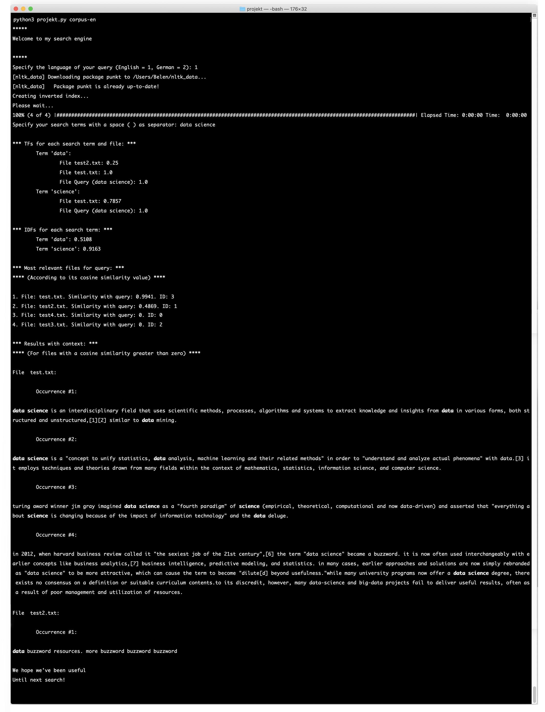

# Search Engine
Mario Varona Bueno

Informationssysteme 2020

## Purpose

Search engine written on Python based on an inverted index structure with the following capabilities:

- It allows and accepts queries to search terms on all *.txt files on the specified directory passed as parameter (as shown on Usage)
- It builds and inverted index structure within a vector space model
- It stems the terms to get a closer sense to the meaning of the expressions
- It supports Snowballing technique for English and German languages
- It uses a structure to quickly go from the Document ID to the correspondent file
- It calculates the Tf for each pair of query term and document
- It calculates the Idf for each query term
- It creates a relevance matrix (as shown on Figures), which puts together each term and document according to their Tf-Idf value
- It sorts the results based on the similarity between the files and the query
- It shows the context for each occurence of each query term

## Installation

The script is coded on Python 3 and it uses the following external libraries:

- nltk, for stemming, tokenizing and snowballing
- progressbar2, for showing a progress bar while the inverted index is cretaed
- numpy, for vector operations
- ssl, for avoiding an exception during the download of the 'punkt' module for nltk

The program will try to install the packages if they are not already installed and the user allows it, but they can be also installed with the following commands:

### Unix

- nltk:
`pip install --user -U nltk`

- progressbar2:
`pip install progressbar2`

- numpy:
`pip install numpy`

- ssl:
`pip install ssl`

## Usage

Run `python3 projekt.py corpus`, where `corpus` is the directory where the search will be done.

## Figures

- `ids` is the structure which guarantees a quick hashed access to each file, and it is a dictionary with the following aspect:

```
{
	"id": "filename",
	...
}
```

where each `id` is an integer which identifies each `filename`. After it is inputted, the query will be added as the last document to this dictionary. 

- `token_list` is the posting list, and it has the following aspect:

```
{
	"stemmed_term": [document, ...],
	...
}
```

where each `stemmed_term` is the result of applying the stemming process to each word of the corpus, and the correspondent list of `documents` is composed of the identifiers belonging to the files which contain that term in its original way.

- `relevance` is the matrix which stores the Tf-Idf value for each term and document, and has the following aspect:

```
{
	"id": {
		"term": value,
		...
	},
	...
}
```

where each `id` is the vector which represents each document, and each `term` holds its correspondent value on that document. More visually, the matrix would have this shape:

<pre>

document ↓	    terms →
			 first term			 second term			 ...
0			 value_a			 value_a2			 ...
1			 value_b			 value_b2			 ...
...			 value_...			 value_...2			 ...
query			 value_n			 value_n2			 ...

</pre>

## Example

Here we have an image showing the working of the program:

